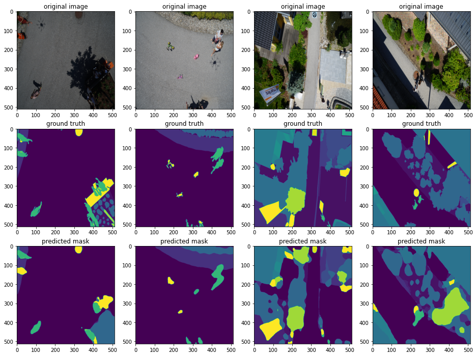
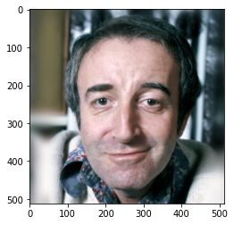
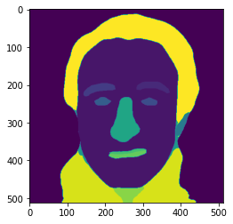

# Image Segmentation
This repo contains source codes for segmenting images using pytorch 
models including bacteria segmentation, aerial image segmentation, cancer cell segmentation and face segmentation in multiple dataset.

If you couldn't load notebooks here, copy links and open it in Google Colaboratory.

 